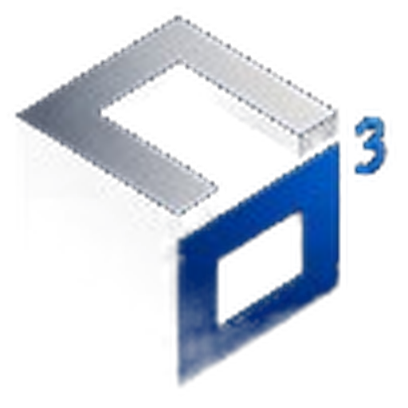

<div align="center">



# S³ LABS

**Engineering better decisions.**

Consultoria independente em **Dados & Business Analytics**
fundada e conduzida por **Mário Schenkel**

<p>
  <a href="https://schenkel94.github.io/portfolio/">
    
  </a>
  <a href="https://www.linkedin.com/in/marioschenkel">
    
  </a>
  <a href="https://baseclara.netlify.app">
    
  </a>
</p>

</div>

---

## Sobre

A **S³ Labs** é a estrutura pela qual atuo como consultor independente de dados. Minha
carreira começou dentro do negócio — anos em **controladoria, FP&A, pricing e revenue
management** — e migrou para engenharia e análise de dados.

Essa origem define o método: quase nenhum problema de dados é técnico no começo. É
pergunta mal formulada, métrica sem dono e base que ninguém auditou. O trabalho começa
pela decisão que precisa ser tomada e termina com o time do cliente mais autônomo do
que começou.

> **Transparência:** hoje a S³ Labs sou eu. Você fala com quem executa, do primeiro
> e-mail ao handover — sem camada comercial no meio e sem projeto repassado para
> terceiros. Para demandas maiores, componho com parceiros e digo isso abertamente.

---

## Serviços

| Frente | O que entrego |
| :--- | :--- |
| **Analytics Engineering** | Modelagem dimensional, camadas `staging → marts`, dbt com testes, lineage e documentação versionada |
| **BI & Dashboards** | Power BI (DAX), Metabase, Tableau, Looker Studio; definição de KPIs e dicionário de métricas |
| **Plataforma & Pipelines** | ETL/ELT, orquestração de cargas, Databricks, Snowflake, Spark, automação de relatórios |
| **Analytics com IA** | NLP e classificação de texto, modelos preditivos (churn, propensão), IA generativa no fluxo analítico |
| **FP&A & Analytics Financeiro** | DRE gerencial, rentabilidade, pricing, revenue management, forecast e análise de desvios |
| **Diagnóstico & Capacitação** | Auditoria de qualidade de dados, governança, treinamento e mentoria de times |

---

## Método

Cada fase fecha com um artefato utilizável — mesmo que o projeto pare ali.

| # | Fase | Entregável |
| :-: | :--- | :--- |
| 01 | **Diagnóstico** | Diagnóstico + escopo fechado |
| 02 | **Arquitetura & Modelagem** | Modelo versionado em dbt/SQL |
| 03 | **Visualização & Entrega** | Dashboard em produção |
| 04 | **Autonomia & Handover** | Time autônomo + documentação |

---

## Cases

Todos os cases usam **dados demonstrativos ou sintéticos** — nenhum dado real de
cliente é publicado.

### 1. Stack dbt + Metabase — [repositório](https://github.com/schenkel94/DBT-Metabase-Stack)
Pipeline analítico completo do dado cru ao dashboard executivo. Arquitetura em quatro
camadas, testes automatizados de unicidade e integridade, lineage gerado pelo dbt.
`dbt` · `DuckDB` · `Metabase` · `SQL`

### 2. Voice of Customer — [repositório](https://github.com/schenkel94/VoC)
Classificação automática de feedbacks com NLP e GPT para extrair sentimento e tópicos,
com drill do gráfico até o comentário de origem. **Redução de ~90% no tempo de análise manual.**
`Power BI` · `Python` · `NLP` · `Databricks`

### 3. Customer Churn Prediction — [repositório](https://github.com/schenkel94/churn)
Modelo preditivo que ranqueia clientes por risco de evasão e aponta o fator principal
de cada caso. **Potencial de redução de até 18% na evasão.**
`Python` · `Spark` · `Databricks` · `Plotly`

### 4. DRE por PDV — [repositório](https://github.com/schenkel94/FINANCAS/tree/main/DRE_PDV)
Análise autônoma de ofensores da DRE na granularidade de ponto de venda, com plano de
ação sugerido por unidade.
`Python` · `Plotly` · `ETL`

### 5. Base Clara — [abrir a ferramenta](https://baseclara.netlify.app)
Ferramenta gratuita que diagnostica a qualidade de um CSV/XLSX antes da análise.
Processamento **100% client-side** — o arquivo nunca sai da máquina do usuário.
`Data Quality` · `Client-side` · `CSV/XLSX`

---

## Stack

| Categoria | Tecnologias |
| :--- | :--- |
| **Análise & BI** | Power BI, DAX, Metabase, Tableau, Looker Studio |
| **Engenharia de Dados** | SQL, dbt, Databricks, Snowflake, Spark, DuckDB, ETL/ELT |
| **Linguagens & IA** | Python, Pandas, Plotly, NLP, IA Generativa, Jupyter |
| **Cloud & DevOps** | Git, Azure DevOps, GitHub Actions, Docker, Netlify |

---

## Este repositório

O site é **estático, sem build e sem dependências de runtime** — publicado no GitHub
Pages pelo workflow em [`.github/workflows/static.yml`](.github/workflows/static.yml)
a cada push na `main`.

```
├── index.html              # página única da S³ Labs
├── obrigado.html           # confirmação de envio do formulário
├── favicon.ico
├── assets/
│   ├── css/main.css        # design system completo
│   ├── js/main.js          # interações (vanilla, sem libs)
│   ├── img/                # marca, retrato sem fundo, OG
│   └── cases/              # capturas dos projetos
└── .github/workflows/      # deploy no GitHub Pages
```

**Design system — "Carbon & Chartreuse".** Base carbono (`#0A0C10`) com acento
chartreuse (`#C8F32C`) e o azul institucional do logo (`#4E8CFF`) usado com
parcimônia. Tipografia Archivo + JetBrains Mono. Sem framework CSS: o
`main.css` é escrito à mão sobre custom properties.

A paleta de séries de dados foi validada em OKLab para separação sob
deuteranopia/protanopia e contraste mínimo de 3:1 na superfície escura —
pior par adjacente ΔE 32,3 (CVD) e 33,5 (visão normal).

Rodando localmente:

```bash
python -m http.server 8000
# http://localhost:8000
```

Histórico: a versão anterior do portfólio (pessoal, pré-S³ Labs) está preservada
na tag [`portfolio-antigo`](https://github.com/schenkel94/portfolio/releases/tag/portfolio-antigo).

---

## Contato

- **E-mail:** [schenkel.mario@hotmail.com](mailto:schenkel.mario@hotmail.com)
- **LinkedIn:** [/in/marioschenkel](https://www.linkedin.com/in/marioschenkel)
- **Base:** Rio Grande do Sul, Brasil — atendimento remoto
- **SLA de resposta:** 24 horas úteis

<div align="center">

---

**S³ LABS** · Engineering better decisions.

</div>
